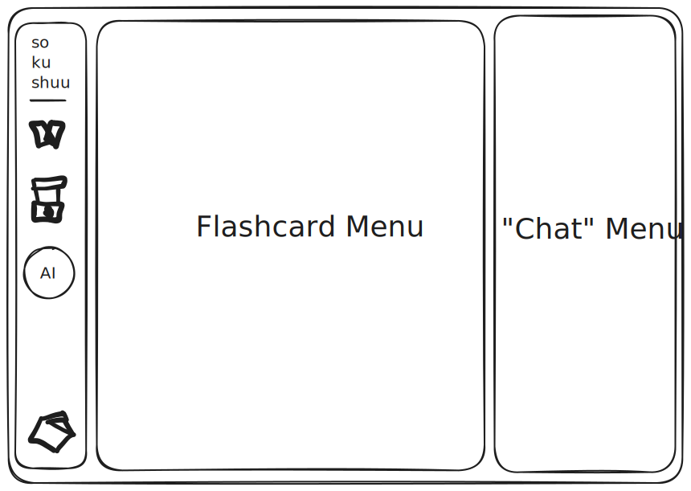
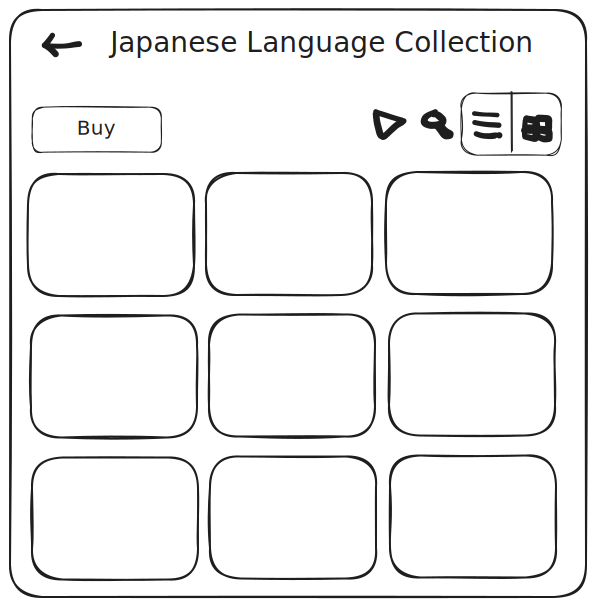
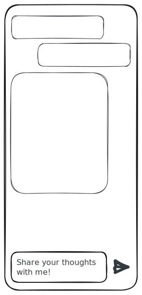

# sokushuu

Sokushuu is a studying platform that enable student to learn knowledge and earn bucks in anywhere and anytime.

### Studying and Earning at the Same Time

Studying and earning are topic that always being put between a thick wall. You have to finish study to earn some bucks. 
But what if you can learn anything while earn things. But how? and why?

In term of blockchain, many chain were designed to be generic, or being focused on either privacy or performance. 
Have you heard a chain that specifically designed for Education? 
Yes, it's [Educhain](https://educhain.xyz/), its where I got Sokushuu idea. 

A specific chain for education, which also pulling universities interest on diving deep into blockchain. 
Educhain as a chain has a unique positioning in the eye of academic experts.
With such opportunities, I believe solution that move around the education itself will be extremely impactful.

### Why Sokushuu for Education Chain

There are a lot of study methods. Each student has its own effective student method for them. 
Sokushuu is for them who want or could study through flashcard method.

Flashcard is a study method through cards. Usually the front part is the question, and the back part is the answer. 
You have to answer the question before flipping the card, and then you flip the card to make sure your answer is correct. 
There are plenty of flashcard study method, one popular application is [Anki](https://github.com/ankitects/anki) with over 20k stars on Github.

What makes Sokushuu different from Anki is, we are running on blockchain. Student own their own flashcards, the ownership is stored on chain. 
If student can make their own flashcard, they can also sell those flashcards. And other student who find those flashcard useful, they can buy them and receive NFT as a proof of ownership. 

As a human being, learning is eternity. As a developer of Sokushuu, providing a platform to learn means eternity to us as well. 
We want to help more students to learn more. Adapt in this volatile day, learn hot languages such as English or Mandarin, or even learning about Smart Contract Development.

If you are interested to try, help, or fund this project, feel free to reach me out. Happy to help more people in the journey. 

Sustainability is also important, and we are paying attention on it. We will explore a lot of options for sustainability so that students are not being forced to pay a huge amount to use the app.

## Technology Stack


Deployed contract on Educhain Testnet: [0xDc85C6a4D2cbe68b5077324Fa909e362BEc94d20](https://edu-chain-testnet.blockscout.com/address/0xDc85C6a4D2cbe68b5077324Fa909e362BEc94d20)

## Get Started

### Clone Repository 

```bash
git clone https://github.com/0xhirugohan/sokushuu
```

### Install Bun

```bash
bun install
```

### Run Backend

```bash
cd packages/sokushuu-api-worker # change directory to api worker
bun install # install dependencies using bun
echo "GEMINI_API_KEY=${your_gemini_api_key}" > .env # setup env
bun run dev # run it
```

### Run Frontend

```bash
cd packages/sokushuu-app # change directory to app
bun install # install dependencies using bun
cp .env.example .env # setup environment variable, fill the value needed
bun run dev # run locally and access it on localhost:5173
```

## Demo Video (2-5 mins) demonstrate key features, problem it solves, 

See the demo in Hackquest Project menu https://www.hackquest.io/projects/Sokushuu

## UI/UX Design

### Homepage



### Create your own flashcard


### Sell your flashcard


### Buy flashcard



### Ask AI



## References

- Icons by [lucide](https://lucide.dev/icons/)
